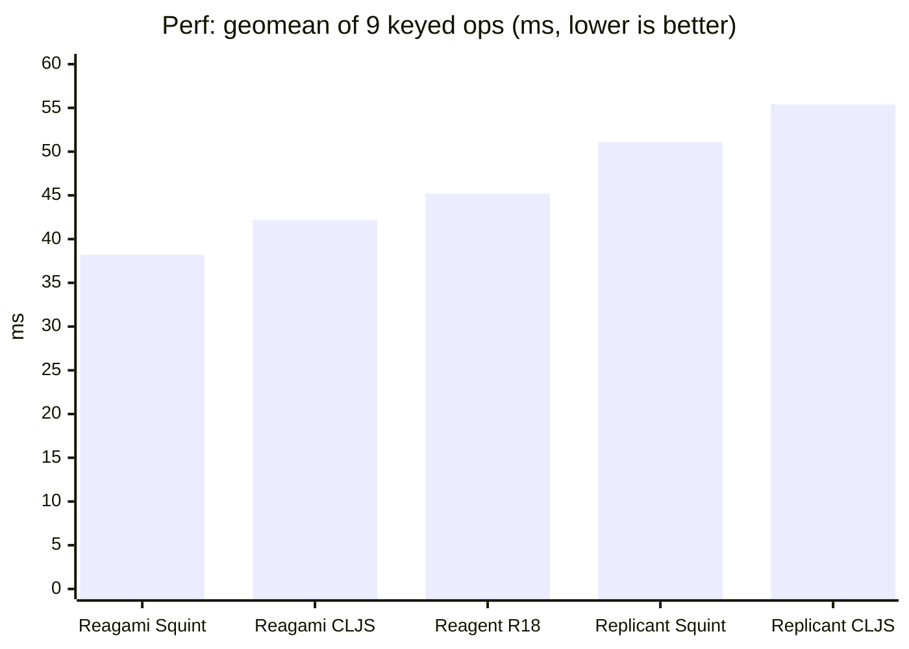
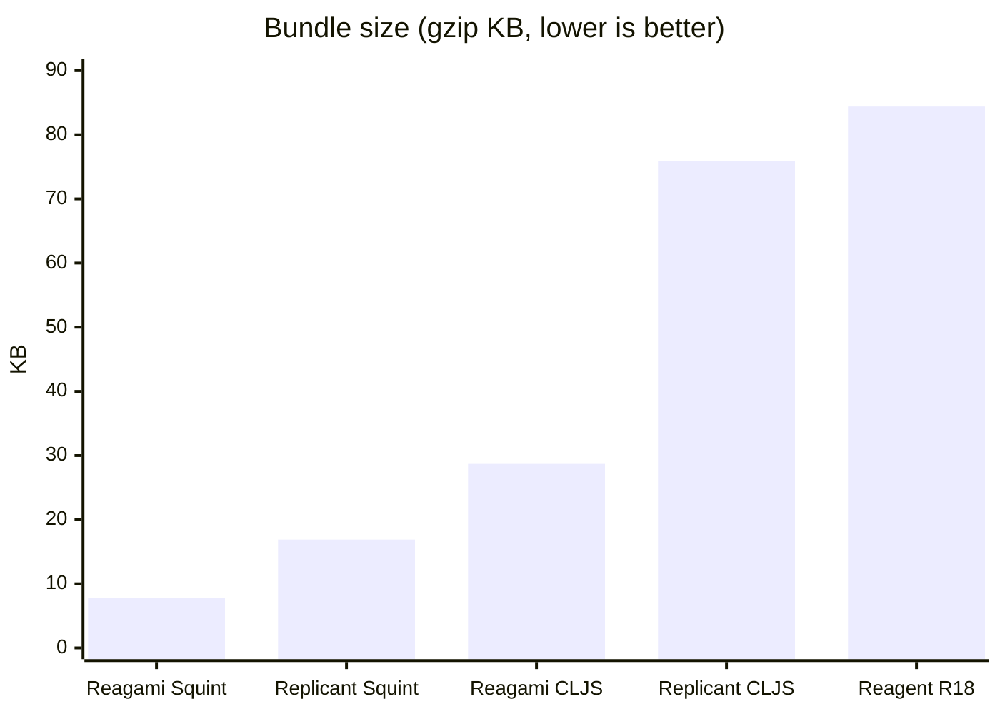

# Reagami


Fold your state into the DOM!

A minimal zero-deps [Reagent](https://github.com/reagent-project/reagent)-like in [Squint](https://github.com/squint-cljs/squint) and CLJS.

## Usage

Quickstart example:

``` clojure
(ns my-app
  (:require ["https://esm.sh/reagami" :as reagami]))

(def state (atom {:counter 0}))

(defn my-component []
  [:div
   [:div "Counted: " (:counter @state)]
   [:button {:on-click #(swap! state update :counter inc)}
    "Click me!"]])

(defn render []
  (reagami/render (js/document.querySelector "#app") [my-component]))

(add-watch state ::render (fn [_ _ _ _]
                            (render)))

(render)
```

([Open this example on the Squint playground](https://squint-cljs.github.io/squint/?src=gzip%3AH4sIAAAAAAAAE3VQu27DMBDb%2FRWMssiD486aCuQTOhpGoUqX2m30iB4NgiD%2FXlhWjC7VDboTSB4pbiPMrZPeNwAXgS55DoSBTSn5KPqeojnEqQ8kP6WZGYSMqMPYtk3DNZ0Qk0wELpMzuAvlsk0U8PJ4AuyyQznjnSWbMIwNMAg9%2FzSoDdixsLQAA98kXotyO664j5ySs7gLZzt1ntU39jxepd9VA9nr5drYs1XtY6GCHQvc0I6N42YqkNUUVju8hurrI%2F%2BKvXYqG7LpcMkUbm90JpVcANtL71mL4W%2Bo9TOk1t1VJjVVR0I85U4WwztKlTT%2FHr4y2qJX%2B19OfcYnpgEAAA%3D%3D))

In ClojureScript you would add this library to your `deps.edn` `:deps` as follows:

``` clojure
io.github.borkdude/reagami {:git/sha "<latest-sha>" :git/tag "<latest-tag>"}
```

and then require it with `(:require [reagami.core :as reagami])`.

Reagami supports:

- Building small reactive apps with the only dependency being Squint or CLJS. Smallest app with Squint after minification is around 5kb gzip.
- Rendering [hiccup](https://github.com/weavejester/hiccup) into a container DOM node. The only public function is `render`.
- Event handlers via `:on-click`, `:on-input`, etc.
- Default attributes: `:default-value`, etc. for uncontrolled components
- Id and class short notation: `[:div#foo.class1.class2]`
- Disabling properties with `false`: `[:button {:disabled (not true)}]`
- `:style` maps: `{:style {:background-color :green}}`
- `:on-render` hook. See docs [here](https://github.com/borkdude/reagami?tab=readme-ov-file#on-render).
- Keyed children for better diffing via `:key`. See docs [here](https://github.com/borkdude/reagami?tab=readme-ov-file#keyed-children).

Reagami does NOT support:

- Auto-rerendering by auto-watching custom atoms. Instead you use `add-watch` +
  `render` on regular atoms or you call `render` yourself.
- React hooks (it doesn't use React)

Local state can be accomplished by using nested renders like in [this example](https://squint-cljs.github.io/squint/?src=gzip%3AH4sIAAAAAAAAE5VTTW%2BDMAy98ys8ekkOLZWmXXJZ%2F0OPCE1ZcEu2kNB8DFUV%2F30KpCr00K3mkOA8Pz87MdEOWi51BkCYxVOQFqHMG%2B87x4oCXbtxTWGRH3krd9vNdvP6lgPjDpKvojTLSI0HcJ57BMK9aeHChAnao4UtMNeYHrwNOFyxGoKEssoASlbLnwzi5jN4bzRcmNFroaT4hhVxPe9eEnPo6rhMdNp4OsQ4yPeN6d8hBzKd7EY0jeRA%2Bgb13cEYNOWFC3P%2BrHCUq4wFdrSIeuK9WpRjUddogRw0lNrUCEoeUJyFwmqBvTMiuJthH0EBWBs7BkShh1IZwdV62dG5bzvQx2wLa8%2FrICf11cNGz1Nc2z33SS3o8ETiu3YsuHazH1o9U066jRVJT7BIjvFmyrHYij68mLkoXtfrnnvRLKpnLJFOy3%2FlkQT%2FA6%2BlonSoYtnT7FhjPJAvV9RGhBa135wC2vMeFQpvLOQr3nX5bXySuHGE7tswcpUhTeatvGVhMTA%2BiA8Yv%2BomPUal%2FS91%2BT%2BoHgQAAA%3D%3D) or using [web components](https://squint-cljs.github.io/squint/?src=gzip%3AH4sIAAAAAAAAE2VSsW7bMBDd9RVXeaEGSZ05FQgKZGjQIdkEDzR5juhQJM07NhUM%2F3shiW5tlBOP9967h3sUnmCaWxVjBSBkwnO2CSsAGOqROZLse6Spo7FPqN7VZGuQiqAU%2BxVJ52w9dzokBJnwiAkGg0ftFNF%2B3zRVJW4lvMzfHU7oeZmHvxm9IThR%2F%2Fz28qN0mqV1tOgMtC5o5VpixQhCcZjgInXInjHB1%2BsiDSB08MQpaw4JBh4trbZAUI6Ymu2ujGk%2FFevxUVPKhN5ggp3oym0RaDbln4cTai4jPGpG86ScOyj98TDokbp6Ki%2F3qLKz%2Fg68NgAGaewvGOQhMwcPFxl8q53VH7AT9Knil0fTOZrV%2B20R1uvmWqTKqZ9W%2BoqAGsRf7Ld7pWZ%2FYw3S%2BpgZLjI6pXEMbrFY8xwRKEzIo%2FXv9XVJc4mzM3i0HkFn4jCV3AjkNLe4Ff%2BCLvF7uK1kX%2F2%2FDHGi3gSdF0J3zpjmV3S4JlrvVIx1A8Od%2BvapNm7zB8tsjFnEAgAA).

Reagami uses a basic patching algorithm explained in [this](https://blog.michielborkent.nl/reagami.html) blog
post. It may become more advanced in the future, but the (fun) point of this
library at this point is that it's small, underengineered and thus suited for
educational purposes.

For a more fully featured version of Reagent in squint, check out [Eucalypt](https://github.com/chr15m/eucalypt).

## `:on-render`

The `:on-render` hook can be used to do something after a DOM node is mounted, updated or unmounted.
It takes 3 arguments: `(fn [node lifecycle data])`

- `node`: the DOM node that is mounted, updated or unmounted.
- `lifecycle`: one of `:mount`, `:update` or `:unmount`
- `data`: the result of the `:on-render` function every time it is called. By
  returning data you can pass data from one lifecycle to another. E.g. when you mount a JS component, you can return `{:unmount unmount}` so you can call the unmount function in the `:unmount` lifecycle.

Example:

``` clojure
(fn [node lifecycle {:keys [unmount updates] :as data}]
  (case lifecycle
    :mount
    {:unmount (install-clock! node)
     :updates 0}

    :update
    (update data :updates inc)

    :unmount
    (do
      (println "Number of updates in total: " updates)
      (unmount))))
```

See a full working example [on the playground](https://squint-cljs.github.io/squint/?src=gzip%3AH4sIAAAAAAAAE41UTW%2FbMAy951ew7kU%2BxMmu7mVANmAdtl3SnQxjUGUmVitTrkQ3C4r890Gy8tFsCeYcIpsi%2Bcj3SEEeOqlpAiBKhy%2BDdjgBgCprmXtfzmbou8K3M4dyLTudQSk9pJc6zycT0eAKPEtGEJJtB2%2Blb%2B0G2A0Ipe2l0rwF4SQ1%2BW7vQKDJszRmqoxVzzcTgOyh1a6BXjrewtclKNv1lpA4gwlARbbBOqA0yFD5XhKIQjmUjJ8NdkgMT37WWDXEcxZuZHkoJT4OqUGXssGt8Mg3IIop429eWOLgE1yOHn89omD7zSpp8EF3uGSnaQ3iyc8%2BScYiz4%2BurDt00eSR74nRvUpzBuHDfD7P6%2Bgi3lnGMKKQfY%2FULFptGgjFn8C7uwOHPDgCZVDS0MOKRq8VQVUnHCG%2FsuStwcLYNWQDdXYgDrC5RYjpDi2Ktw1Kd8AbqziYC4edfcVzPPmR0UEHFr9LTfDzfiQtQKnKRr%2FeRiNUZe8QRO%2Bmnh18jKoZm1CVjwOzJXgrLU2V0eo5sLSR%2FU0S19A34W8UF1nOd2PJegVi%2FJjiQfZFNwiLWB5ky2AaX%2F43lfTeqnPtpnzZopW0RkjGLIYUmxbpDMbYuFh96uHYidj2vVTeSs9bgwHKPtnhlOLsDrIKcEepjERHFoxeodqqGOMZtx6qRHNqmK%2FjxDaS5a7%2Bt7iFkv4k0KUJKGPYS9a3cp9XvB%2FtKJbLY1UmmDDfTS5mHu9cMoskjVDjMZ4mlV%2BJSFerEY29sgh6p4kNQfZj6B7RgV3BMSuwZWlKyPbfrq2UBCOM0a6u8%2FowTInnOEEirdvZnvyTRVe8DOi2SzSo2DrIbmXfZzlUQ1rOsmmmG8mqTdIuy1MF%2FYL4q%2FcraJzmdP4DI1TwhhsGAAA%3D).

## Keyed children

You can add a `:key` property to your elements to identify nodes. This will result in better performance when Reagami re-renders.

``` clojure
[:ul
 (for [{:keys [id label]} items]
   [:li {:key id} label])]
```

## Patch algorithm

Reagami first checks whether any child has a `:key`. If one does it runs the keyed patch algorithm, otherwise the unkeyed one.

For a single node, `patch-node` decides reuse of an existing node or to create one from scratch. Two text nodes reuse the old node and update its text. Two elements with the same tag reuse the old node, sync its attributes and recurse into its children. Anything else builds a fresh node.

### Unkeyed

The unkeyed algorithm (no `:key` used on any child) matches children by position.

- The shared prefix is patched index-wise using `patch-node`. Example: old has `n` children, new has `n-2` children: the shared prefix is the first `n-2` children or vice versa. So index `0 .. (n- 2 - 1)` are patched using `patch-node`.
- Then fix the tail which can mean:
  - More new children than old: extra nodes are appended.
  - More old children than new: remove the extra old nodes. One special case of this is that there are 0 new children in total: here we clean the parent node as an optimization, with `parent.textContent = ""`.

Example: old `[a b c]`, new `[x y]`. Positions 0 and 1 overlap, so `a` is patched toward `x` and `b` toward `y` in place. Position 2 is old only, so `c` is removed.

The unkeyed algorithm doesn't move any nodes, so expensive collapses can happen, e.g. when a new node must be inserted at or near the front. In a situation where extra performance is needed, add `:key`s so the keyed algorithm will be used, which can reliably move nodes around.

### Keyed

When any child has a `:key`, the whole list is reconciled by key. Keyed and unkeyed children can be mixed: the unkeyed ones take part in this same pass, matched positionally. This single example hits every case. `x:n` is node `x` with key `n`, a bare letter like `c` is an unkeyed node.

```
old:  a:1  b:2  c    d:3  e:4
new:  b:2  a:1  f:5  d:3  c    g
```

1. Match each new child to an old node and note that old node's position (1-based, `0` marks a brand new node):

```
b:2  ->  old b    pos 2    matched by key
a:1  ->  old a    pos 1    matched by key
f:5  ->  create   pos 0    key 5 has no old node
d:3  ->  old d    pos 4    matched by key
c    ->  old c    pos 3    first unused unkeyed old, taken in order
g    ->  create   pos 0    no unkeyed old left

positions = [2 1 0 4 3 0]
```

2. Remove old nodes nobody matched. `e:4` was not matched, so it is removed.

3. Find the longest increasing subsequence of the positions, skipping the `0` holes: the largest set of nodes already in the right relative order. From `2 1 _ 4 3 _` that is `a` (1) and `c` (3). Those two will not move.

4. Place nodes right to left into the parent, moving only the ones outside that subsequence. The DOM can only insert a node *before* a reference node (`insertBefore`, there is no `insertAfter`), so each node is anchored on its right neighbour. Going right to left means that neighbour is already in its final place. The rightmost node has no right neighbour, so its anchor is `null`, which `insertBefore` treats as "put it last":

```
g    new             ->  insertBefore null  (last child)
c    in subsequence  ->  leave in place
d    reused, moved   ->  insertBefore c
f    new             ->  insertBefore d
a    in subsequence  ->  leave in place
b    reused, moved   ->  insertBefore a

```

Result: `b a f d c g`, with `e` removed. Only `b` and `d` moved, `f` and `g` were created, `a` and `c` never moved. That subsequence step (from Vue 3) is what keeps moves minimal: a plain swap moves two nodes instead of cascading the whole list.

## Benchmarks

The numbers below come from [js-framework-benchmark](https://github.com/krausest/js-framework-benchmark), keyed variant. All frameworks ran on the same machine with headless Chrome and CPU throttling, 10 iterations each, reported as the median in milliseconds. Reagent runs on React 18.

Reproduce: [borkdude/js-framework-benchmark](https://github.com/borkdude/js-framework-benchmark)

| benchmark (median ms) | Reagami Squint | Reagami CLJS | Replicant CLJS | Replicant Squint | Reagent (React 18) |
|---|---|---|---|---|---|
| create 1k | 27.4 | 30.3 | 58.5 | 54.0 | 39.4 |
| replace 1k | 30.1 | 32.3 | 66.5 | 63.4 | 45.8 |
| update every 10th | 45.3 | 50.9 | 47.5 | 44.5 | 29.4 |
| select | 33.0 | 42.3 | 30.8 | 26.9 | 9.7 |
| swap | 43.8 | 52.3 | 53.8 | 45.1 | 103.2 |
| remove | 26.6 | 31.0 | 24.5 | 22.1 | 21.1 |
| create 10k | 295.7 | 297.3 | 453.1 | 471.6 | 532.4 |
| append 1k | 41.8 | 43.3 | 73.7 | 65.4 | 44.1 |
| clear | 9.7 | 9.7 | 19.6 | 18.9 | 30.1 |





Reagami under Squint is both the smallest bundle and the fastest at creating, replacing, appending and clearing rows, and at creating 10k rows. Reagent wins partial update and select through React's targeted re-render via `r/track`, but is slowest on swap. Squint beats CLJS on size and on most operations. Replicant and Reagami end up close on keyed swap and remove, since both place nodes with the same longest-increasing-subsequence step.

## Examples

Examples on the Squint playground:

- [Input field + counter](https://squint-cljs.github.io/squint/?src=gzip%3AH4sIAAAAAAAAE41TTY%2FbIBC951e8sKqED05a9cahW6naay%2BrnqyoYs0kprXBC%2BNYUeT%2FXmGcZpO9rDmYgXkfMIx0EZ22bgVIFeh1sIFQiYa5j2q7pdhtYrMNpA%2B6swJKRyzBrihWK2loj8iaCVKz73BWtR8cU8BnqNj4ERwGmi65DoNFtVsBlTL2uEKavAzM3uGsvCvr1tZ%2F8SDjqPv1wjz0Jv0ynfNcTAkH8dz48RECMu98n7OLRA45NuTuNmZQ1sVZRT61NNttfYA6BCI3ZeKU1AeC7EMZOdwQz5vW9QPjrI66HQhyiW9krl86VU64PZWO0ddYsLL8hk9QrMOBGJm4KKb3khfbozXcQHz9UjdieidpaK%2BHlstsUPxytXccfNuSQWYaLTdY0sQbnY%2FW4lJl6%2Briv774MSM6WosLo7R7SDqSe4ScMffXVVwvrFI9xNORXPZ4JbkU5L5qIpAR05vji5%2BekdTWYleksbzQ4D2nF%2B4D5J%2B4Nb4eOnK8eR0onJ6ppZoT3YPue5H9SOPZ3ybXgTTTU0spgjD2KC7eZSReo7QG4kqBW%2FiLN6dNH6gnZ4ri2hCBnKGQm0IuvbVdFpNvVMPSa9qYctRcN0stlMppCbh3qH5jHrtEk9azyDL%2FBzxJOKDpAwAA)
- [Boring crud table](https://squint-cljs.github.io/squint/?src=gzip%3AH4sIAAAAAAAAE71WTY%2FbNhC9%2B1fMclGABiJv0EsBBWgStLn20BxVdkGbY5tZidSSI28MY%2F97QZHU135k20Nt2JCo4ZuZN29G5MZDI7VZAfDS4X2nHULFjkStL29u0Dcbf7xxKA%2By0QxK6SHdiPV6teIK97C3rim00QSX0sgGgbEVLD4lKk3aHD4CuQ4f01ZrdgieJCFwSbaBSymNbmTt4fL4BCMhBXejz8cchgGpVBG3X0ElQkb%2BQbZX2cHeQNVfiqfIvEaCqg%2BeF7%2BmHdFTn9L6hWBAK%2BCeHHAnjbJN0XVardfPeADg0nu7K7RJ8NWQq1YiU9f%2FlVqBVo%2Fr8MnJOWzsCcf85JMEu1b1UWdUpYM%2F4AFNTpCi3WtIQ6BjiAlFBKQMtNdYq0KbtqPiKI2q0a0A2J9InTMeJKRFoKOk5NbDSdYdgjbQF7yR7bsVQGcUOrjD8zt40HRMRntnG7Dmt6M0BwQ8oaGgrKrfeYfnPvBQ1lTSlER4nArQZxJM0z3fbAChIOkOSFD0bqYsx2ROstbqI1S9yAbJ8NaZqIm4BpNL7vEeeCzhuByA4ZVnyWloDbmtMVIJVeS80Kr3qvfAD0ihHJ%2BWwhksx%2F4SUapVGcEupadzjXApt9YFjtnP7XfwttYKtrXc3bFFn5V0bhEY4XdadHEZi%2FKWYEKuYtEzpTUpwesfiW2J1PfkT7DJddvkwj2KlGz7L8ISk4kRnzn7kNugnwNx%2BWXI3AxjhsN04%2BOgi9brHCK5aF2VpKBa1DwjiqlNue2IrIEPHzZbMuFXtE430p03bVfXhdOHI01JvpRK%2B4CqgBtLwGdylut5RUJBdrXe3cUeenZmxaZ5OKIZUnzRDPhisiwdzmyfTq5nB85E2GAsrdczuYbmGPhmX%2BUJGbAvShN7kUrouRz562lVYcC4OZUDO9d8MXtTYWeRsL%2B69%2B9%2F%2F4UJIaYz2yMVoeefeyHF2bR4nT3RZv%2B435wlFDL6v3t8fBP%2Bh7aebH6lk8VqWa03qf51zfPo%2FNNkHE8Df4P8%2BeRU8ZKc%2BaTQM4Wyz0qxMTMhFtX1ubJKn6JR6zC8aIpwpkhR5%2B0hyc3kP9joFrMW6IhSDZrPYg7rwP6QDTKRbiYXYhhOW6vSO5I3so2UVLcgxZyXvy%2FlHZ7jkYeN07NgwzFjLrVqMmHlKB0%2BtHmuzGpmHpgUYkKXs5aKnW1aa9DQgrXr2%2Bd5g9UI6QewHiv0onXAv%2FkbZXddg4Y29x2681escUfWAbuWbctiXFxZsnPjnUNJ%2BKXGcAdM6RPL2XGPdAXhhcNGCJhvD3RvWoctGjU%2F5fUHoTgs0kH7Ji2GuKGaMxGHTZDog6TdMR9cy7glH49uof%2BKABnWo8N0%2FQ90N%2F1yAgwAAA%3D%3D)
- [Snake game](https://squint-cljs.github.io/squint/?src=gzip%3AH4sIAAAAAAAAE41WW4%2BjNhR%2Bz684y6iS2YoJTLsvZGenlbqqql2pUi9PiFYOPiSeGJu1HRI6yn%2BvbJNAZpnVECngw%2BfP534g0kBDuVwAkFzjlz3XCEW0tbY1%2BXKJprk126VGuqENjyCnBoZFGceLBWFYg%2BH%2FIdylMaxWsNGcBQG5S493aRwgFQoBWYAgrbZBcA9Z2h4Di5IVgrHUolOFWtXAU24k3SEUxTvI0hKKH8PtB3crYQVccsupgABbK9Yv4HzljGsoMkgdsFEdlxvQfLO1E0itFIMiC%2BwjnRNPUFTwDh%2FA6j2ezjZL0FQy1SSBolwAFMSJEi6ttz%2BGZ%2BvysrVRHSaDaW4nMQfavrkYD0BqCcVTvsPeQBGAzhp%2FVtCm9JEw9lQOihJeA5HKDu%2Fji%2F5mNJgItFBskTIgHVZQkO%2BBSLsFUnNtbHBjDGkcpO7INB6Z5q95jmzCkcXO9pmt1OIDkHvwGjnjZlESD4OzvNKkUtKELc5mzzG8Xu%2BtoBcd4nnVj0ExT5DOIvoJIptFbLlNDlSIByBKA3kPR%2B%2B099C%2FQHnlsA%2F3cDynyId76MPziwcZFPUDEKMahJuzt75z6YXGjt6J4%2FI5g3MV%2B5p2oj01RlVg7CXJayoMzqgyUeTVe0J4R3iI0hjOUH5kUkhzTshRGPwGTRyuxWK1gr94gxqEUu2CPJqlQfubtKg7KqY1d5emAf4J%2B7WimkGlpNVKmAW5pYx97FDaz9xYlKjh0SwPXDJ1gGiHPVMHGS2GCsXg8VBWO%2ByB3CbuhpdQTCsb9i1zN9eYXs4RT8y4%2FiqY14GlBmGH%2FbdzLfpZa3X4u41Cd7j31VikkJXx%2BTHJ5kvzOckvzu5nNMmE55U0n7G21zSuQQ8siX9%2BDc0fro9f8yQTolfwMK7PeRN6sptHicbKQlEcoS%2BhUkL5KBS5Fz%2FlRyBv4eiRMeS9W%2FVhNTkrP3Bmh%2FGWb9Ep6hdTSM2FCPyncShsaINJSMcwFHxWXQ%2BB6QA4wU8%2BrUKiFDnjXTijyE23gadBEfI2TONB60GjK%2BmVp3Jje4HwlK%2BVZqghytojGCU4g7Wg1S6a9Wu%2BptVuo9VeMohuEOvodBqAq1Xox%2BeKqJWGoqV6aNNjnv%2FjbQVirAb3Pj5BMUbF74g2GlFGl%2BCuVtNZPUF7R0UaWVSOUOdhUB1q%2FyfouXrIYYtyfngWucVjiP271MU8S1PXt6RNho%2BeIZpRcM4Jol%2FdKb93qN9EZVyOH0laKTeJ%2FcB4NEumqn2D0t5%2B2aPu%2F0SBlVUaohvatlFQgDBl1TW40kgtfhToVhAx3kXxpdWgfQMJZxCNFHC93X0h3bYaW5RsmvwapYt1yLvh8245CJ3eUIzZGSyijCUHaqvt0NvyPMDPrfFf8L%2FS0Tl5OGx4%2Fh8hQm1YdAoAAA%3D%3D)
- [Draggable button](https://squint-cljs.github.io/squint/?src=gzip%3AH4sIAAAAAAAAE5VW247rNBR9n6%2FYhBdHIu0cCSTkIB0EnDfgAYQEiirkxjuXM66dY%2B90Ekb9d%2BRLMr0dNLQPaeK1L157eaVMOziIXj8AMG7x09hbhCrriAbHt1t0h43rthZFKw59Blw4SDe7PH94YBIb2CtRPxWdUVgMxsELn%2BDrx0fgs7%2BcFpQjQQhMkDkEyLsICReh%2BiO%2BB7IjnnzasoQ%2FqFc9zdCMuqbeaBeyaKiVcfgeqgnmnW9aaAnsO2C%2FCOq2Yu%2BAFTAB49NVW3mewzeP%2BQMA3OBnYHy%2Bj%2FfdpMotUlGrHjUVFmuCCo8UWlBIUFlgmxbpBzNq2ev2xwD8zePYpiBhWyTAI%2BX5LrTwwhU2YS1cbf4VJzMErBnA5gsNH46oCTqhpUK7cHAwo8PiYI5YpBWoTNM4jP00eu1t6W7y22Sb1P%2BfoZNAUgzLIy%2FxM19g%2F1qw84rdJTDrG2BpHhPMrzmYRYf0RRr5yzLeRiiHp8%2FDJpjO2rj58Bnm%2F1y%2FVFG%2B6HPhaxzO2NKBvpWuv1e%2ByhIs%2BjWgDmNkuFO9I9RoI6mbiAnT%2BTmtwEe3fe61NM%2BQrXEZpFI37UjzrF8biq18dNvaaGcUbpRpgQekB3rSytJLEPZJYRBEaJrQ5yIwhQfUtIryhT%2Fh7KAKGiMz7E5vUemZGuLIw2yuBJSDT5rfDITfyCf3lfPTiixLkNj0GmE2o4XA7sIDm80IQlkUcoZOHBH6sxqJSmB3DkAS5zpEIeXnpyek%2FD%2Bju8k5DmtGoE5Qkoy71Mxbi41DtmzpTKOvulmFI61oW7FXWOxHIqOh8tutuOyPvlbFu3fABls4svB9OFWRj4pHfHIeR7Py5%2B2fotcSJ%2Fj2coh8MK73lguZ2DujRsLsChG9y5e5Y7SQDVOWQ3kVE%2Bwthtx4bQy5CtiL%2Bqm1XqmQ1UYZy2NYmZ2imLJfDUGHFmFQKBxmYbPsuUMNbHGDxEPMfUHEG6h4Cxk3dKSK92m4JuICvJ4RHoafzv4dv1iA2U9WtHDAbJfvVpVYY6iozWEw2r87okaupbPAA9r7hbHBfqSpR28hm08j2vl3VFiTsZB9KYYhTYhJQ%2BYSXFsUhB%2Bi%2B0Am%2B%2BM6TRYsvuglZK8p4DJ8b%2BS8GSwOqOW53i1q6c0xeGP627FND33fUF3uNf4lEVIWz4LqLr1YOI8hq9dD%2BO58Sv88Fky%2F%2FwXZoHfzEAkAAA%3D%3D)
- [CSS transition](https://squint-cljs.github.io/squint/?src=gzip%3AH4sIAAAAAAAAE4VTuW7cMBDt9RVjuqGASLsu3LBKEyB9SkEIuORoRYeXydGuFwv%2Fe6DDeySCLRbikG8e31zcZ3DS%2BAKAi4Svg0kIDeuJYhabDWZX536TUO6lMwyEzLAYbVkWBdfYQSZJCFxScHAWfThggk7ajO8fEA%2B78Fap4GLw6AmatgBohDYHOItMJ4twFkejqQf2tN3GN1bAv5%2Fo0ex7%2BgSwk%2BrPPoXB60oFGxJw0wFfBH2fVJbAEmoGbGcHZOUKCSXpsyETPLD%2FCLf1cwaUGb%2FBhOtCctfDNU1X2KqYrKRF%2FlQ%2Fl%2BxilKu6tMnRyhOwzuJq9NKava8MocvAFHrCtAZ7GTKZ7lSp4GksxSfQOWZ27A2txqaGlEdADGaieL9iRPCVC0PGiRweeT7K%2BLB0yhD1%2BFty4QOVK44W5QG%2FdJyeZD8n2yFrL%2F2WQqDVhhsdGhETAo%2BpynQpRjvd3PVp%2B8E30Y0jMjbVS97ooAaHnurXAdPpF1pUNGbiUcZ4qR7XgcI9XCWUhD8suin12hxuas0z0gNURgO7pYF7il3QpzomjOh1WV4HLKHXmOZA%2BTKim%2BVwVA%2FNfUrm8ZVaV0dJql8yLMTscltt3nlofsO02pF7BMwvL%2Fu%2FoRmemkUEAAA%3D)
- [Ohm's law](https://squint-cljs.github.io/squint/?src=gzip%3AH4sIAAAAAAAAE41U24rbMBB9z1dMVcrKBSdOtvuih15Y6FOh0MK%2BGFOm9iRWK8teSU42hPx7sXwv2c3KINvjOWfOXCxu6LGWhuAmZrlzlRWrFdliafOVIdxhIRkItNC9JMFiwTPaarBKZmQgdjmF6MoCUlRpuNVQocEC9qhqgkJqKPAJrKMKpN6jkhk6sskCIBZSV7WDk3DHioAZ1DtiCxiXaEn8PrN7WqnnNnxqQs1sPmyz%2FWc9KoKTOMjM5cDuonfsPHModdhK41sNMSXTj9PFFTmINR3CViiv0FgKs7L%2Breg50AUa3JHrdgLm0OzIsQCYZ2VB8KwAAG4PWL2BvgkvBfXJZOjwBTrvF36Exu1aAhytLdOu3UMRgquwTHrcZBquYrrRCpp1HkfQm8u8sBCfxF86Woj3pXK4I0hrY0g7MGSldahTSvwYN4mdmwJwuQWupfoEHaQV0SXVuIHoyfj7C3zBBUDvxVc96wwQdMqh0Rx6CPe%2FzmkItd6MLNHyDsSIh82HczDk7ikUHsKqgcU%2BJT%2BOr6jEGT4PCtphiEUm920XYpHfAvueFzcWvuEB7lGltUJXGpb0HoMzsIc2jAAGfOnKr%2FKJsiH5TQDsof%2Bl4%2B7EGJMf%2Bzfk398juI0gWq6HaiSXgt%2B33%2BbB%2B4Sb4F9eFbxHDIWHW4iW0XqQdTH4j6Gg8%2FjTjgXAXqVggpk8RrCOIpjKSMYBMKT9%2Bes7353Oq87I%2F9hVVqZ1QdotH2syx5%2BkKHWlAfYWq4q1sxvPhqjlxiwLD%2BjSfCJUWIeO2gPkF%2FjryhnSKGqUtCPfPf8D1kkK%2FGsGAAA%3D)
- [Multi select](https://squint-cljs.github.io/squint/?src=gzip%3AH4sIAAAAAAAAE31TTa%2FTMBC891cs%2By6ORFIQQkK%2BgIA7B45RhEy8SVwldmpvWkrV%2F44cO6%2BiD5FI%2BVhPZiaza2EDTMrYHYCQno6L8QQ1DsxzkPs9hakKw96T6tVkEKQKkF%2BaHQDU7egOi6cqsDe2X9cD%2B6YodjuhqYPAigmEYjfBVQYaqWXS8HTFVjEC%2FjRe4%2B224S0MyuqRynZQtieoKcqIkRhqN7NxNoCY1HwCeVLjQiCqCghKVr4nhnIT%2BJawRbG6BBHOan6VzagQXAt3L27DPntIFaiTBP%2FiyFLLXL5m6XS984jWWVbGho8g7tVPq2iR0MUt2omEz1qLgTrRa3OKEfFlJLjKzlkuOzWZ8QIYlA1lIG86BDkrrWPW%2BNbThLeVspad89P6r4kIv2cDEjBFYDoQgY7%2F8FasgJgS%2B%2F3BGQv4GvA%2FQBTWWSowp1tnIFzltIxs5pGA%2FUIZvR0ymN8E7x6rzm7N%2Fqv1Lz7OuUzK98aW7GbAN9X7GMEDdPtiMrY8G80D4Id7UrANEqB2PQJ%2BdT02DytpNr8ofrGyzivg53hrmubeR09Wk0%2B9FHmL7HNRHMJeu3aZyHJ1XMhfUnecB3xS84wF1ItJm0ZpXZ4Vt0OeVikTSaTtLNQ%2FYD2bKBLraWzz8x8d%2Bf9YzgMAAA%3D%3D)
- [Web component](https://squint-cljs.github.io/squint/?src=gzip%3AH4sIAAAAAAAAE2VSsW7bMBDd9RVXeaEGSZ05FQgKZGjQIdkEDzR5juhQJM07NhUM%2F3shiW5tlBOP9967h3sUnmCaWxVjBSBkwnO2CSsAGOqROZLse6Spo7FPqN7VZGuQiqAU%2BxVJ52w9dzokBJnwiAkGg0ftFNF%2B3zRVJW4lvMzfHU7oeZmHvxm9IThR%2F%2Fz28qN0mqV1tOgMtC5o5VpixQhCcZjgInXInjHB1%2BsiDSB08MQpaw4JBh4trbZAUI6Ymu2ujGk%2FFevxUVPKhN5ggp3oym0RaDbln4cTai4jPGpG86ScOyj98TDokbp6Ki%2F3qLKz%2Fg68NgAGaewvGOQhMwcPFxl8q53VH7AT9Knil0fTOZrV%2B20R1uvmWqTKqZ9W%2BoqAGsRf7Ld7pWZ%2FYw3S%2BpgZLjI6pXEMbrFY8xwRKEzIo%2FXv9XVJc4mzM3i0HkFn4jCV3AjkNLe4Ff%2BCLvF7uK1kX%2F2%2FDHGi3gSdF0J3zpjmV3S4JlrvVIx1A8Od%2BvapNm7zB8tsjFnEAgAA)

## License

MIT
