# Benchmarks

Reagami is compared against other CLJS UI libraries using
[js-framework-benchmark](https://github.com/krausest/js-framework-benchmark), the
keyed variant. The summary charts live in the [README](../README.md#benchmarks);
this page has the full numbers, the methodology and how to run it yourself.

## Methodology

All frameworks ran on the same machine (Macbook M4 Max) with headless Chrome and
CPU throttling, 10 iterations each, reported as the median in milliseconds.

Framework versions: Reagami b756045, Reagent 2.0.1, Helix 0.2.2, UIX 1.4.9, and
Replicant a22f871 for the CLJS entry / 4bfd556 for the Squint entry, which builds
Replicant from a local checkout. Reagent, Helix and UIX run on React 19.2.
"Squint" and "CLJS" denote the compile target.

The Reagami Squint column is the b756045 run scaled per operation by the speedup
of the current patching code. That speedup was measured on the same machine
against the same build. The other frameworks were not run again.

One reproducibility caveat: the Squint entry resolves Reagami from npm, where the
published package still trails this source. The numbers here are for Reagami at
b756045, so reproducing them needs that build rather than a plain `npm ci`.

Every entry is built the same way for its target, which matters: an entry built
with different settings is not comparable. The CLJS entries all build with
`shadow-cljs release`; the Squint entries all build with `squint compile` plus
`esbuild --bundle --minify`. An earlier version of this page reported Replicant
CLJS at 75.9 KB, which was a figwheel build with `:pretty-print true` left on in
its advanced prod config - a toolchain artifact, not Replicant's cost. That entry
now builds with shadow like the rest, which is where 41.2 comes from.

The benchmark renders one large data table. Each row is an item with a numeric id
and a label of random words. Each operation is triggered by a button click and
timed:

- create 1k / create 10k: build a table of 1,000 (or 10,000) rows from scratch.
- replace 1k: replace all 1,000 rows with newly generated ones.
- update every 10th: change the label of every 10th row in a 1,000-row table.
- select: highlight a single row.
- swap: exchange two rows far apart in a 1,000-row table (row 2 and row 999).
- remove: delete a single row.
- append 1k: add 1,000 rows to an existing 1,000.
- clear: remove all rows.

Each operation runs several times. The median is the middle value of those timings,
so a single slow run does not skew it. The best result per row is in bold.

## Performance

| benchmark (median ms) | Reagami Squint | Reagami CLJS | Replicant CLJS | Replicant Squint | Reagent | Helix | UIX |
|---|---|---|---|---|---|---|---|
| create 1k | 27.4 | 27.9 | 58.5 | 53.8 | 39.3 | **26.1** | 27.1 |
| replace 1k | **28.4** | 30.9 | 68.2 | 64.5 | 46.1 | 31.5 | 31.6 |
| update every 10th | 33.2 | 46.3 | 49.8 | 47.0 | 30.7 | 24.6 | **20.7** |
| select | 23.9 | 35.3 | 31.6 | 26.3 | 7.3 | 13.2 | **7.0** |
| swap | **33.2** | 45.0 | 54.8 | 45.8 | 98.8 | 102.0 | 95.3 |
| remove | 21.1 | 27.8 | 27.1 | 23.1 | 18.5 | 16.4 | **14.6** |
| create 10k | 281.6 | **277.8** | 453.5 | 450.3 | 448.1 | 366.1 | 381.8 |
| append 1k | 33.5 | 37.5 | 73.3 | 63.9 | 44.8 | **31.3** | 32.5 |
| clear | 10.2 | **9.3** | 17.5 | 21.2 | 31.3 | 19.8 | 18.1 |

Geometric mean across the nine operations (the ninth root of the nine medians
multiplied together), one summary number per framework, lower is better:

| framework | geomean (ms) |
|---|---|
| UIX | 32.3 |
| Reagami Squint | 32.6 |
| Helix | 36.0 |
| Reagami CLJS | 38.1 |
| Reagent | 42.6 |
| Replicant Squint | 52.0 |
| Replicant CLJS | 56.0 |

```mermaid
---
config:
  xyChart:
    width: 850
    height: 480
  themeVariables:
    xyChart:
      plotColorPalette: "#ff7f0e, #4c78a8"
---
xychart-beta
    title "Perf: geomean of 9 keyed ops (ms, lower is better)"
    x-axis ["UIX", "Reagami Squint", "Helix", "Reagami CLJS", "Reagent", "Replicant Squint", "Replicant CLJS"]
    y-axis "ms" 0 --> 60
    bar [-5, 32.6, -5, 38.1, -5, -5, -5]
    bar [32.3, -5, 36.0, -5, 42.6, 52.0, 56.0]
```



### Patching without reading the DOM

Reagami keeps the DOM node on the vnode and diffs against the previous child
vnodes instead of walking `childNodes`. Position and reuse come from array
indexes rather than from a map and a set keyed by DOM node.

Both builds ran in one session on the same machine, 15 iterations each, median
in milliseconds. The table above scales its Reagami Squint column by these
ratios.

| benchmark (median ms) | before | after |
|---|---|---|
| create 1k | 28.6 | 29.2 |
| replace 1k | 32.2 | 30.6 |
| update every 10th | 43.9 | 35.6 |
| select | 25.2 | 21.7 |
| swap | 36.6 | 32.2 |
| remove | 22.3 | 22.8 |
| create 10k | 281.9 | 283.3 |
| append 1k | 37.1 | 35.7 |
| clear | 9.0 | 9.1 |
| geomean | 35.0 | 33.0 |

The gain is on the patching operations. Creating nodes is unchanged.

A copy of the unchanged build ran alongside as a control and measured within 4%
of the original on every operation, which is the noise floor of this setup.

## Size

The same data-table app, compiled with production settings, gzipped. The Squint
figure is on squint-cljs 0.14.206; of the 9.0 KB, around 1.5 KB is protocol
dispatch machinery that a plain-data app never exercises.

| framework | gzip (KB) |
|---|---|
| Reagami Squint | 9.2 |
| Replicant Squint | 16.9 |
| Reagami CLJS | 28.7 |
| Replicant CLJS | 41.2 |
| UIX | 91.7 |
| Helix | 98.4 |
| Reagent | 99.5 |

```mermaid
---
config:
  xyChart:
    width: 850
    height: 480
  themeVariables:
    xyChart:
      plotColorPalette: "#ff7f0e, #4c78a8"
---
xychart-beta
    title "Bundle size (gzip KB, lower is better)"
    x-axis ["Reagami Squint", "Replicant Squint", "Reagami CLJS", "Replicant CLJS", "UIX", "Helix", "Reagent"]
    y-axis "KB" 0 --> 100
    bar [9.2, 0, 28.7, 0, 0, 0, 0]
    bar [0, 16.9, 0, 41.2, 91.7, 98.4, 99.5]
```



These are the full benchmark app. A minimal Reagami app under Squint is smaller,
around 5.5 KB gzip (a static hello world), rising to around 6 KB once it uses an
atom.

## Running it yourself

The framework entries live in a fork of js-framework-benchmark:
[borkdude/js-framework-benchmark](https://github.com/borkdude/js-framework-benchmark),
on the `cljs` branch.

```sh
git clone -b cljs https://github.com/borkdude/js-framework-benchmark
cd js-framework-benchmark
npm ci
npm run install-local            # installs the server + webdriver-ts driver
```

Build the frameworks you want to measure. Each entry has a `build-prod` script:

```sh
cd frameworks/keyed/reagami       && npm install && npm run build-prod
cd ../reagami-cljs                && npm install && npm run build-prod
cd ../reagent                     && npm install && npm run build-prod
cd ../helix                       && npm install && npm run build-prod
cd ../uix                         && npm install && npm run build-prod
```

The Squint and CLJS entries need a JVM with the Clojure CLI and `clojure`/`squint`
on the path. The React entries (Reagent, Helix, UIX) need only npm.

Then start the server and run the driver:

```sh
cd server && npm start            # serves on http://localhost:8080, leave running
# in another shell:
cd webdriver-ts
node dist/benchmarkRunner.js --headless true --count 10 \
  --framework keyed/reagami keyed/reagami-cljs keyed/reagent keyed/helix keyed/uix \
  --benchmark 01_ 02_ 03_ 04_ 05_ 06_ 07_ 08_ 09_
```

Results land as JSON in `webdriver-ts/results/`. Use `npm run results` to render
the official report.

The `replicant-squint` entry compiles Replicant from source under Squint, so it
expects a Replicant checkout at `~/dev/replicant`. Adjust its `squint.edn` path or
clone Replicant there to include it.
